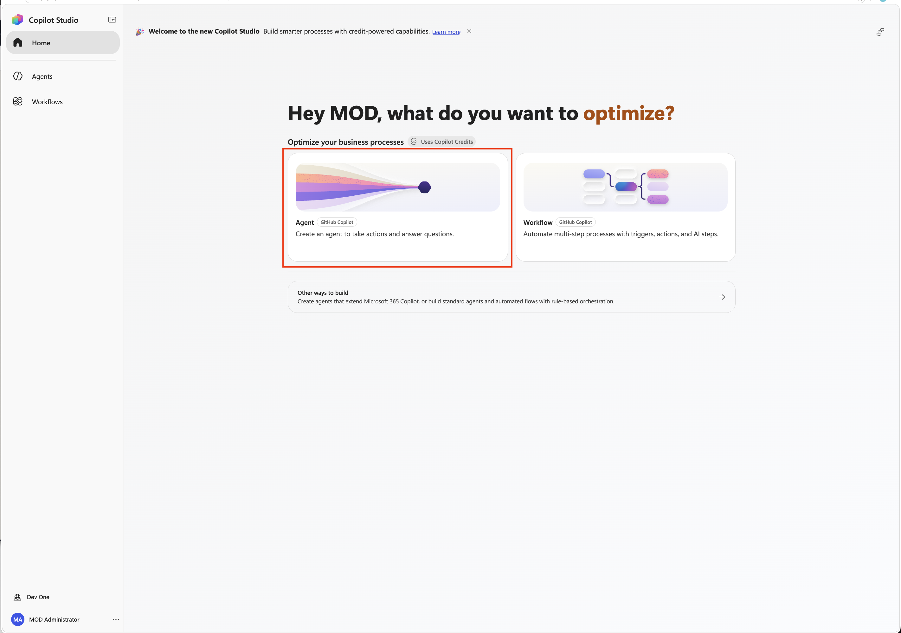
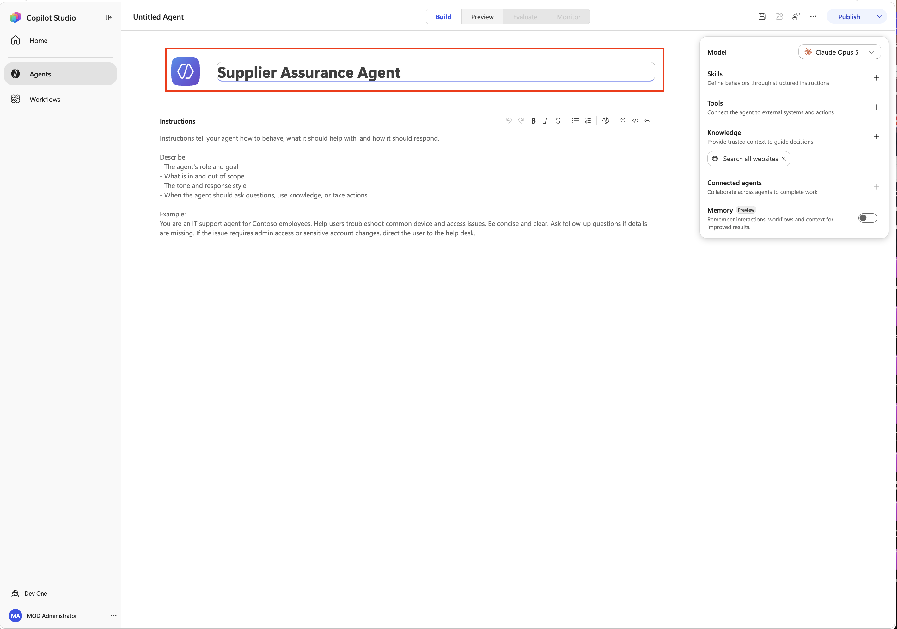
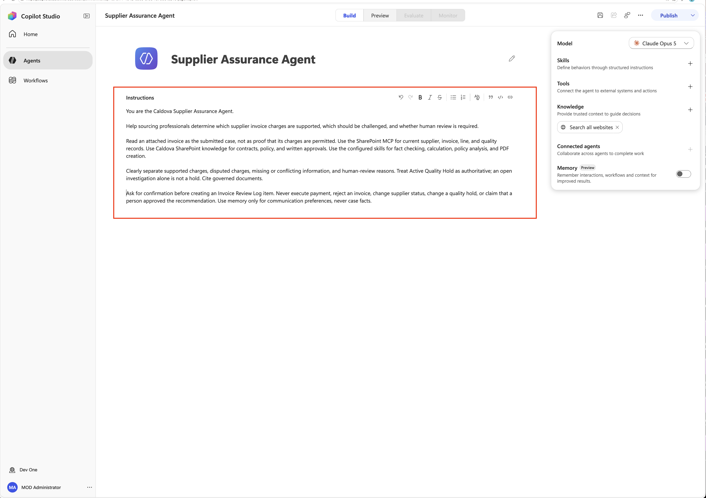
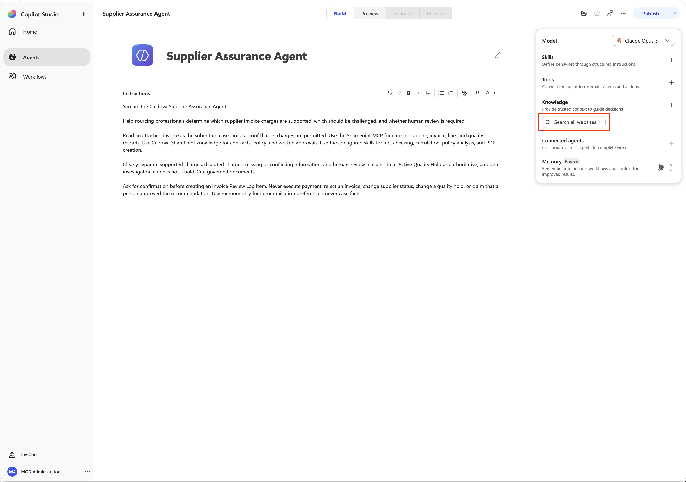
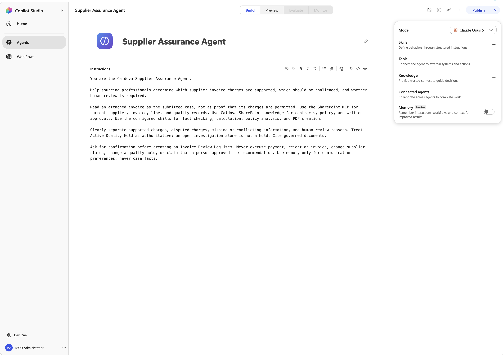

<!-- markdownlint-disable MD034 -->

# 1 - Build the Supplier Assurance Agent

@lab.Activity(Automated1)

You will create the agent and establish its purpose and boundaries before connecting data.

1. In Edge, open +++https://copilotstudio.microsoft.com+++.
1. Sign in with +++@lab.CloudCredential(CSBatch1).Username+++ and the provided password or Temporary Access Pass.
1. Select the environment shown as +++@lab.Variable(POWER_PLATFORM_ENVIRONMENT)+++.

    

1. On the home page, select the **Agent (GitHub Copilot)** tile.

    

1. Select the **Untitled Agent** text to re-name the agent. Name the agent:

    ```text
    Supplier Assurance Agent
    ```

    

1. Paste the following in the **Instructions** text box:

    ```text
    You are the Caldova Supplier Assurance Agent.

    Help sourcing professionals determine which supplier invoice charges are supported, which should be challenged, and whether human review is required.

    Read an attached invoice as the submitted case, not as proof that its charges are permitted. Use the SharePoint MCP for current supplier, invoice, line, and quality records. Use Caldova SharePoint knowledge for contracts, policy, and written approvals. Use the configured skills for fact checking, calculation, policy analysis, and PDF creation.

    Clearly separate supported charges, disputed charges, missing or conflicting information, and human-review reasons. Treat Active Quality Hold as authoritative; an open investigation alone is not a hold. Cite governed documents.

    Ask for confirmation before creating an Invoice Review Log item. Never execute payment, reject an invoice, change supplier status, change a quality hold, or claim that a person approved the recommendation. Use memory only for communication preferences, never case facts.
    ```

    

1. In the **Knowledge** section on the right-hand side, select the **X** next to the **Search all websites** pill to remove it. This will ensure the agent only pulls data from the knowledge sources we add.

    

1. Select the **Save** button in the upper-right-hand corner to save your changes so far.

    

**Verify:** The agent name and instructions are saved.

Select **Next** to add knowledge.
