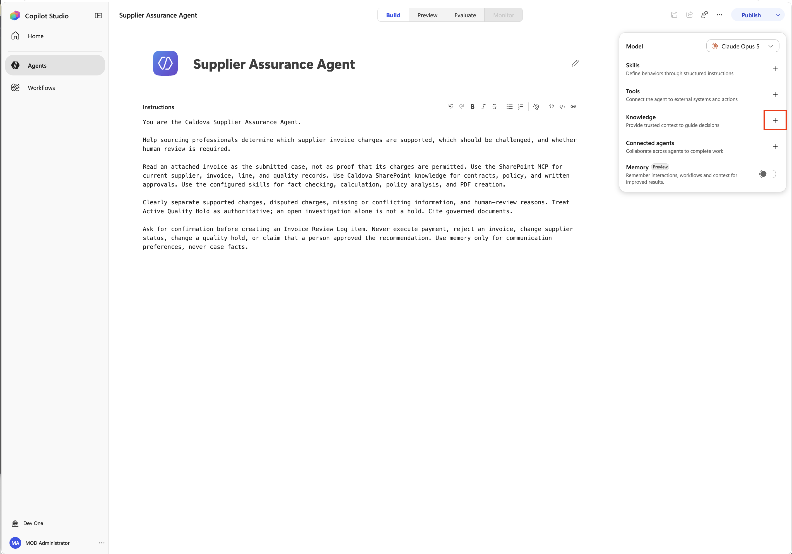
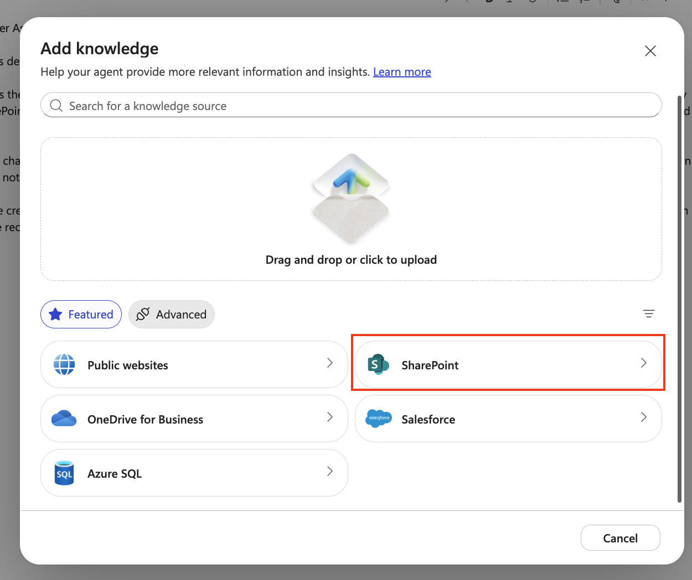
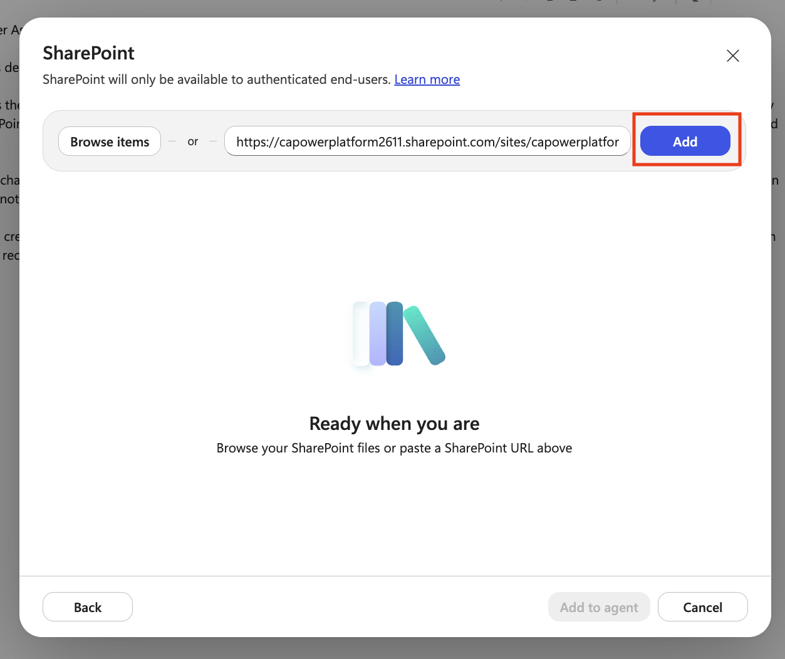
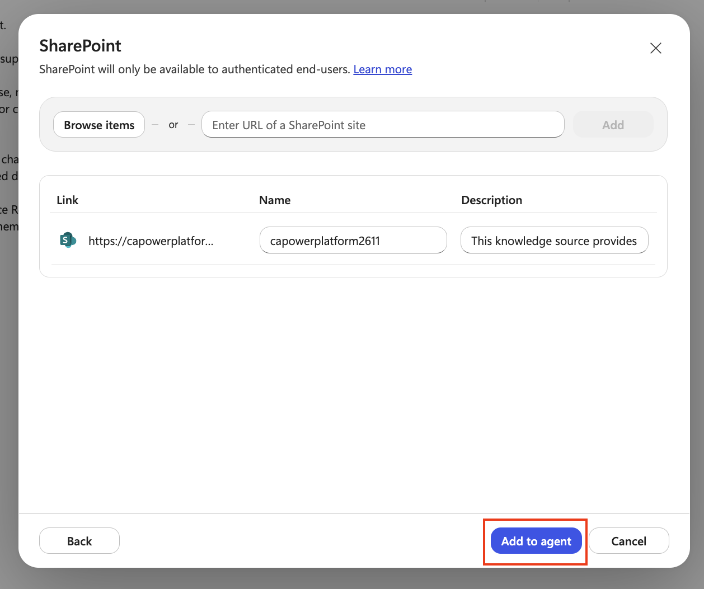
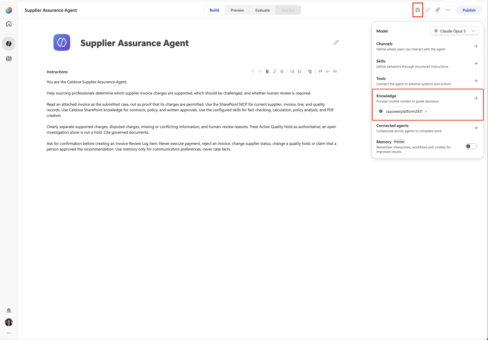
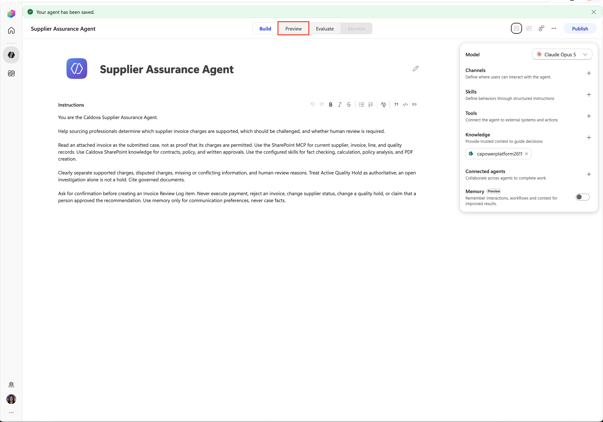
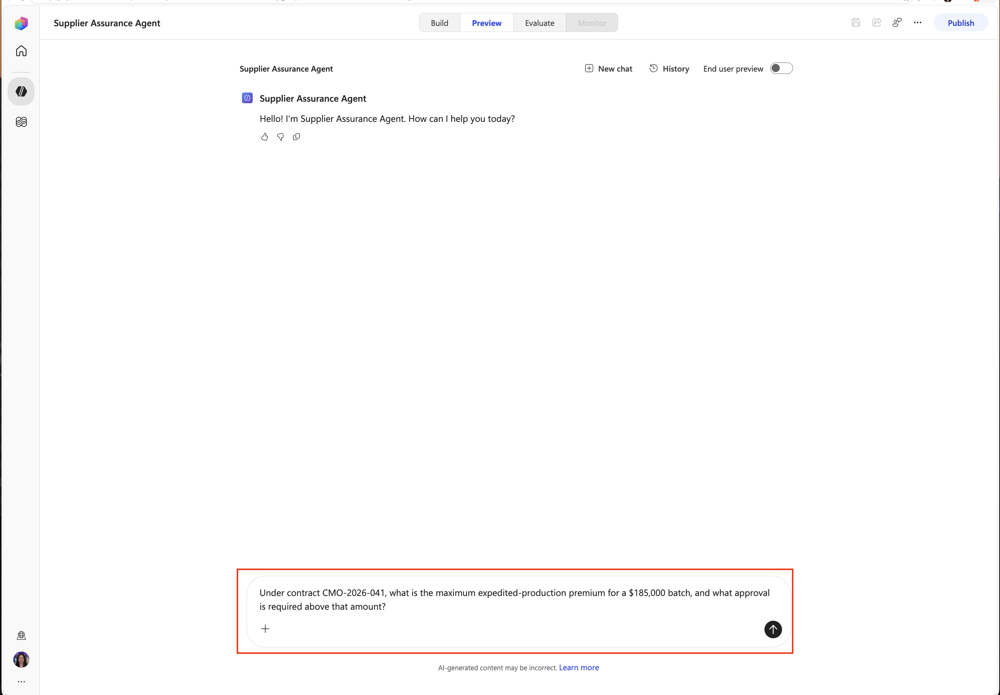
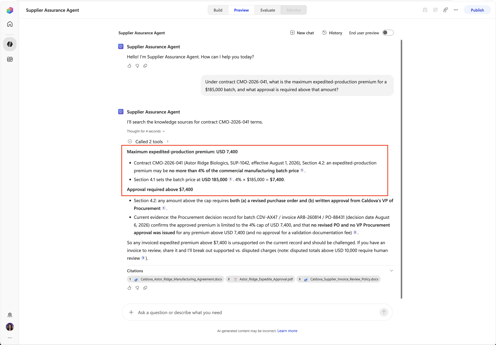
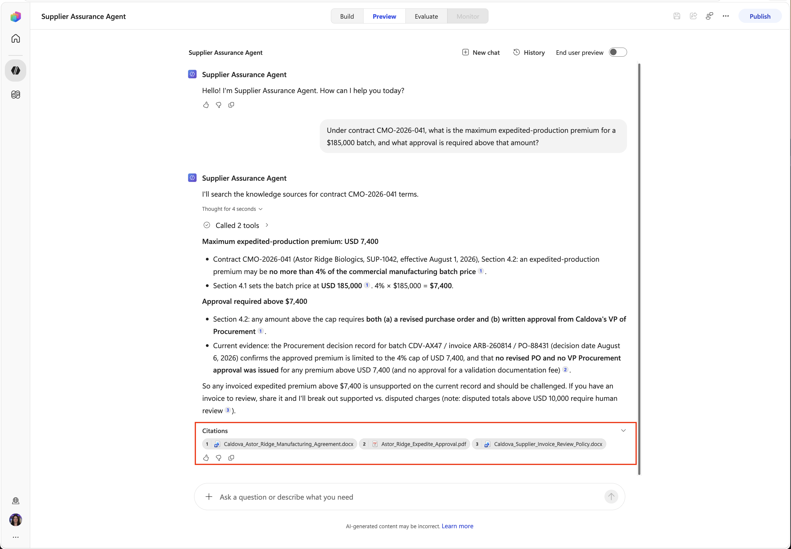
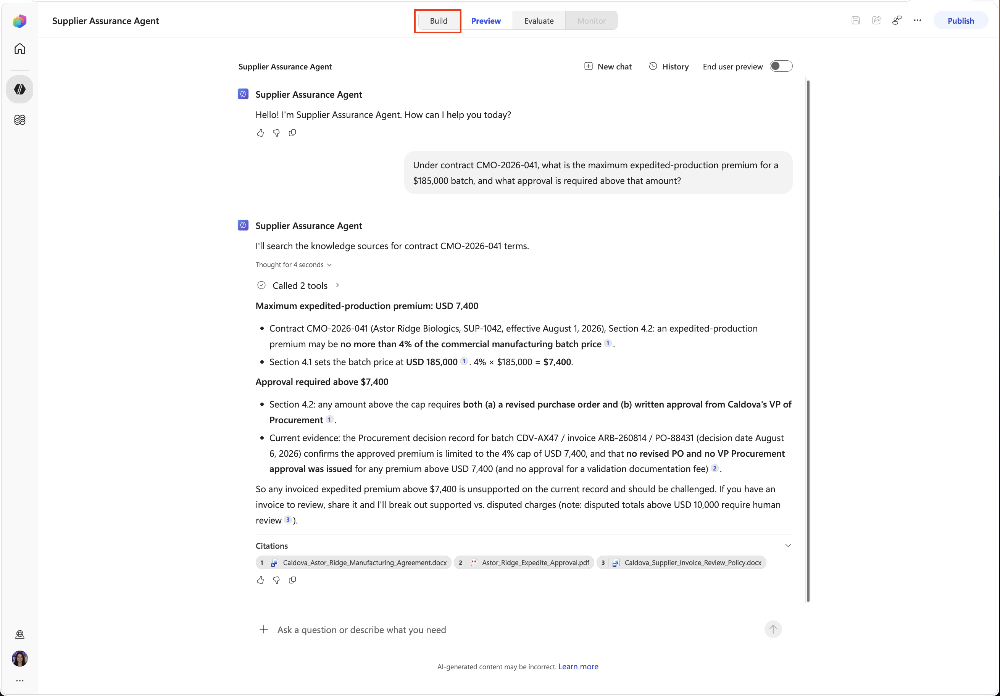

<!-- markdownlint-disable MD034 -->

# 2 - Add SharePoint Knowledge

Contracts, policy, approvals, and quality documents are are the sources that will govern the supplier reviews. You will connect the prepared SharePoint library as agent knowledge.

1. On the agent overview, find **Knowledge** and select **Add knowledge**.

    

1. Select **SharePoint**.

    

1. Enter the assigned tenant root site URL then select **Add**:

    +++@lab.CloudCredential(AITour27M365E7).TenantPrefix+++

    

1. Review the knowledge details and select **Add to agent**.

    

1. Confirm the knowledge source is now showing in the knowledge section. Select the **Save** icon in the upper right hand corner.

    

> [!NOTE]
> **Why:** Knowledge retrieves relevant information from governed documents. It's different from an MCP tool, which performs live operations against data.

## Test document knowledge grounding

1. Select the **Preview** tab at the top or your agent to open up the testing screen.

    

1. Paste the following in the **ask a question or describe what you need** box then press **Enter**:

    ```text
    Under contract CMO-2026-041, what is the maximum expedited-production premium for a $185,000 batch, and what approval is required above that amount?
    ```

    

1. Confirm the answer identifies 4%, `$7,400`, and the need for a revised purchase order and written VP approval.

    

> [!TIP]
> Wording can vary. Validate the facts and source rather than expecting an exact sentence.

1. Click on each of the **Citations** shown below the response and verify where the answer came from.

    

1. Select the **Build** tab to go back to the configuration screen.

    

Select **Next** to continue with the lab to connect live SharePoint operations.
