# 5 - Personalize, Evaluate and Publish the Agent

Now we'll see how to add a layer of personalization to the agent with memories. Then we'll do some more thorough testing with evaluations and publish our agent.

## Enable preference-only memory

1. In the **Build** tab of your agent, location the **Memory** section and toggle the setting to **On**.

    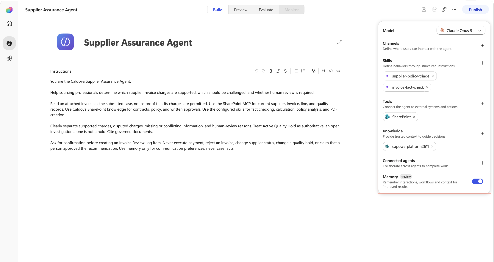

1. Select the **Save** icon in the upper right hand corner.

    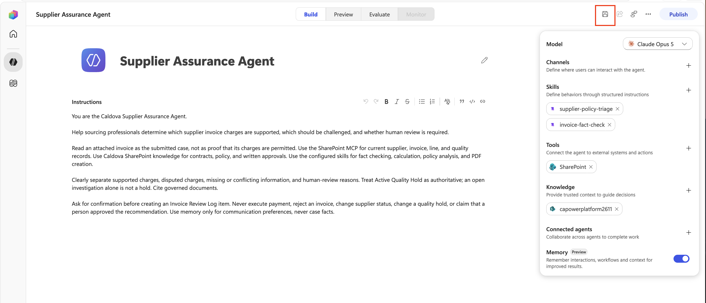

1. Select the **Preview** tab.

    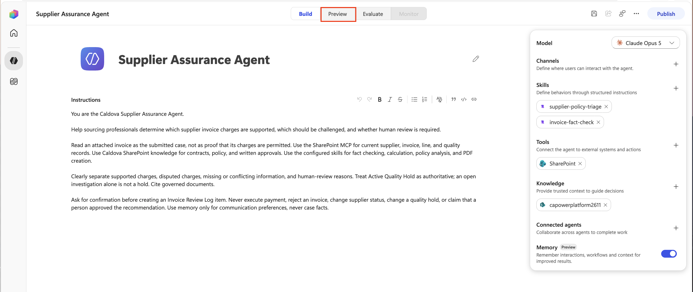

1. Select the **New chat** button to start a fresh chat. Copy and paste the following into the input window to have the agent save a memory:

    ```text
    Remember that I am based in London. Use UK date and time conventions, and put anything that needs my attention first under a heading called My actions.
    ```

    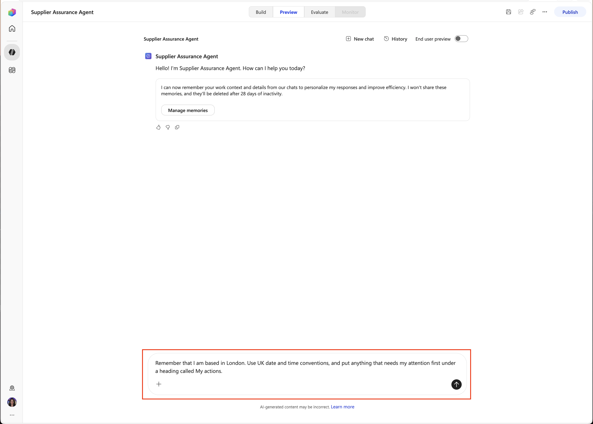

1. Verify you get a confirmation that the memory was saved.Select the **Manage Memories** button.

    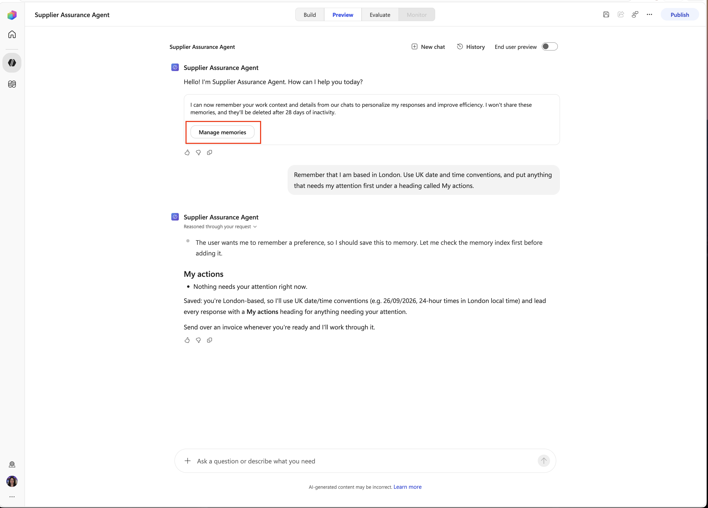

1. Verify that the memory was saved. Close out of the tab and go back to the tab that your agent is in.

    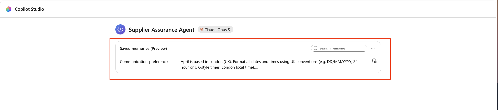

1. Select the **New chat** button to start a fresh chat. Copy and paste the following into the input window:

    ```text
    Give me the Astor Ridge ARB-260814 review result. Include the invoice date.
    ```

    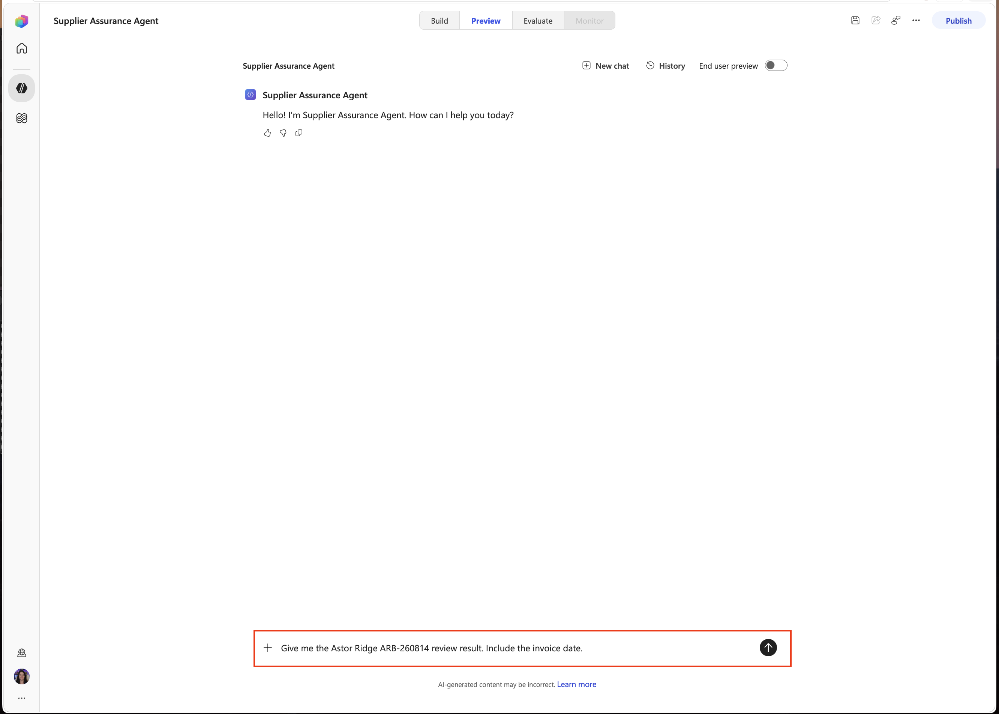

1. Confirm the response puts required attention under **My actions** and shows the invoice date using a UK format such as `14 August 2026`, not `08/14/2026`.

    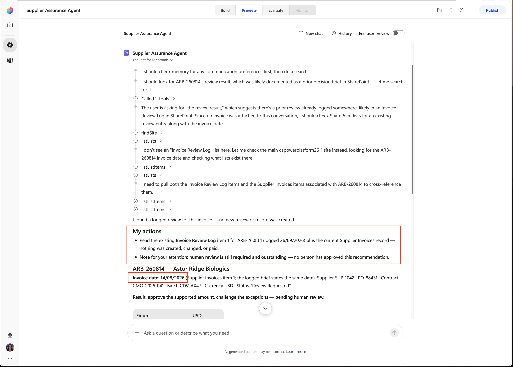

1. Select the **Build** tab to go back to the configuration screen.

    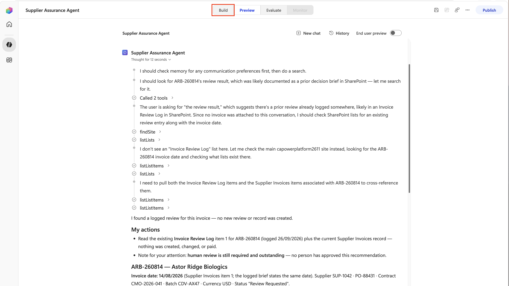

> [!IMPORTANT]
> **Why:** Location, date format, and personal working style are durable user preferences. Supplier facts, approval limits, case decisions, and quality status can change and must never come from memory.

## Evaluate the configured agent

1. Select the **Evaluate** tab.

    

1. Select **Create your first evaluation**.

    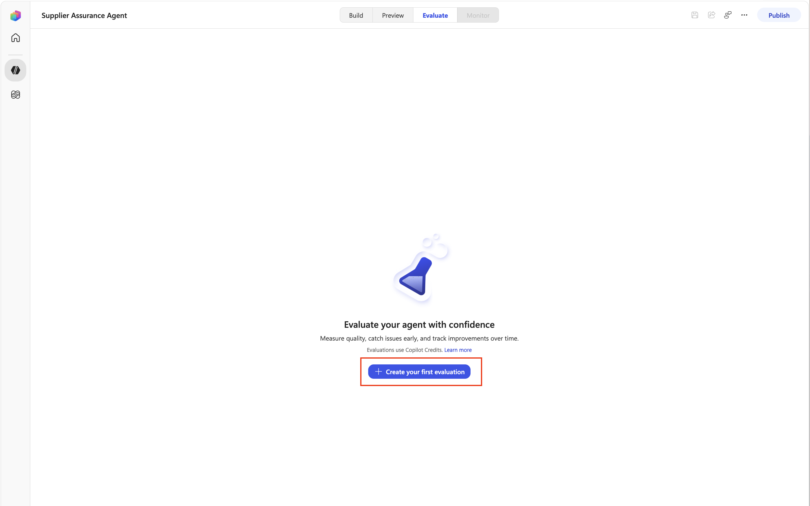

1. Select the **Browse** text and select this file:

    ```text
    C:\LabFiles\ILL224\evaluation\Supplier-Assurance-Baseline.csv
    ```

    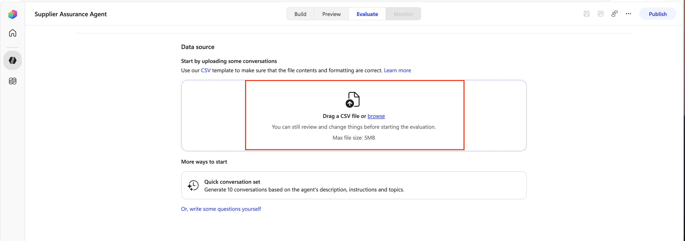

1. Name the evaluation `Supplier Assurance baseline`.

    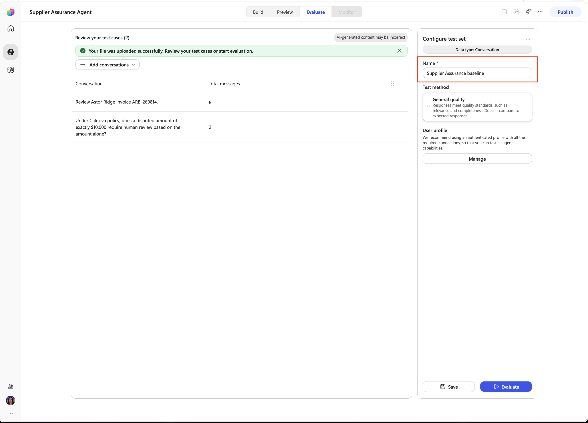

1. Confirm the import contains two conversations: the multi-turn Astor Ridge review and the `$10,000` human-review policy threshold. Select the **Evaluate** button to start the evaluation (this will also save your evaluation)

    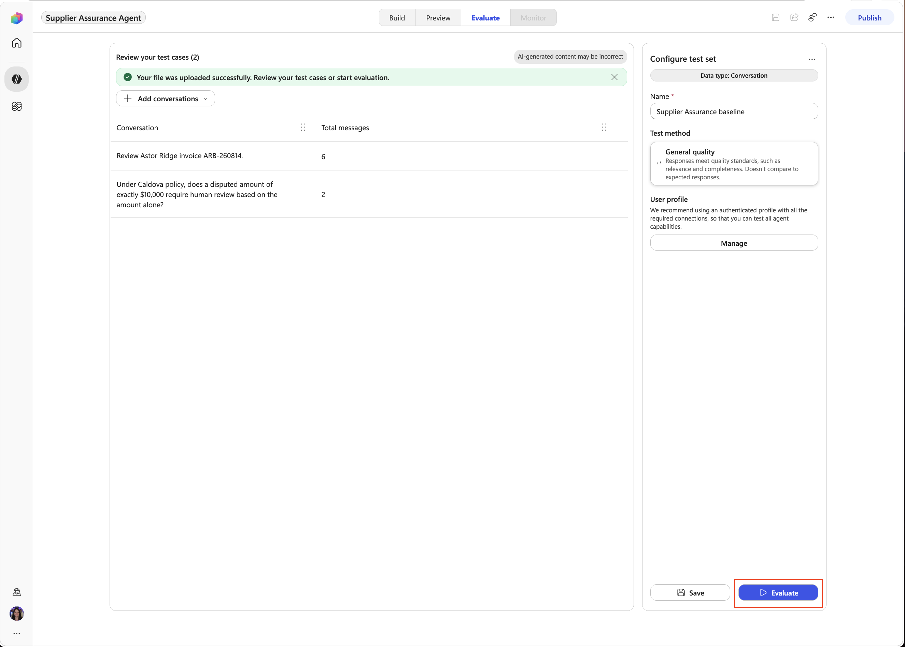

> [!NOTE]
> The evaluation can take 5 - 10 minutes to run.

1. Review the evaluation results and check to make sure that everything shows as **passed**.

    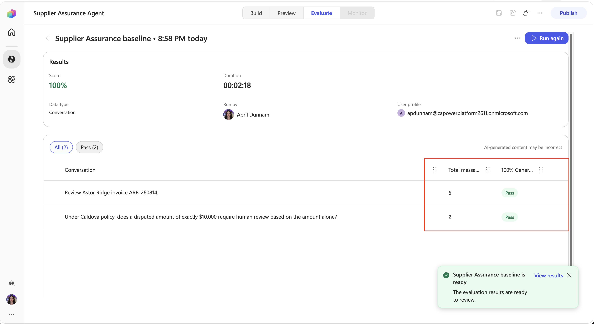

1. Select the **Review Astor Ridge invoice ARB-260814** conversation.

    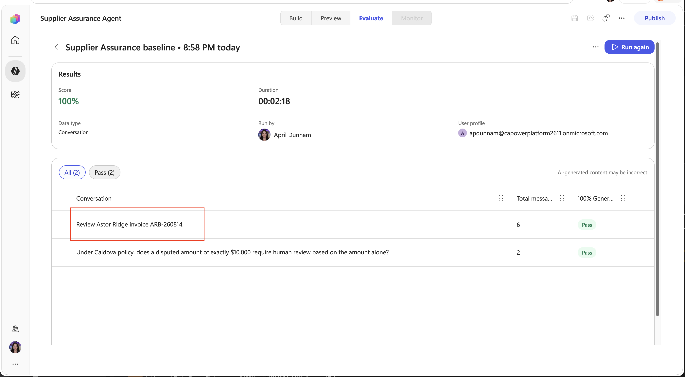

1. Review the conversation flow, paying attention to the knowledge used and tools called so that you understand what the evaluation did. Select the **X** to close out of the conversation.

    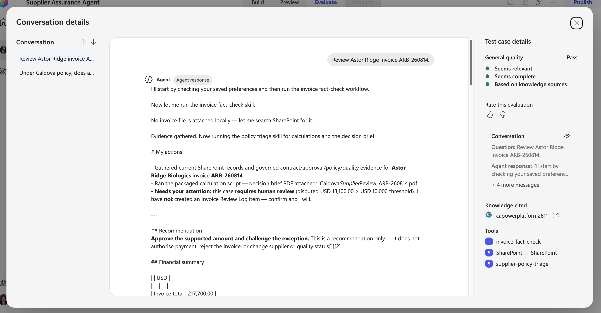

> [!NOTE]
> **Why:** A multi-turn conversation tests whether the agent maintains case context while preserving its grounding and action guardrails. General quality evaluates the conversation without requiring identical wording.

## Publish

1. Select the **Publish** button in the upper right hand corner and wait for completion.

    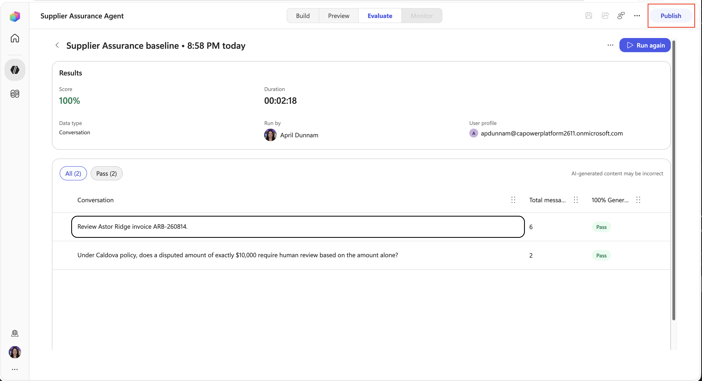

1. In the dialog, select the **Publish agent** button. Select the **Done** button after publishing is complete.

    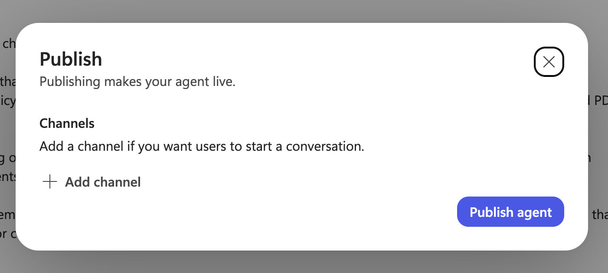

Select **Next** to build the workflow.
