# 6 - Build the Workflow

Now you'll create a Workflow that starts an invoice review when a SharePoint request is added. The Workflow only orchestrates the work; your agent retrieves records, applies policy, and produces the response.

## Create the Workflow

1. Select the **Workflows** tab in Copilot Studio.

    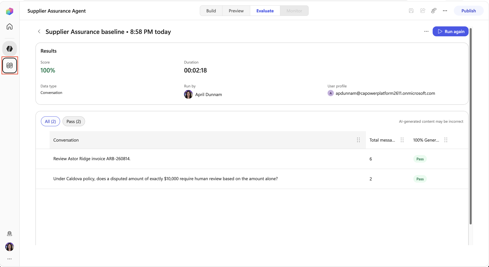

1. Select the **Create your first workflow** button.

    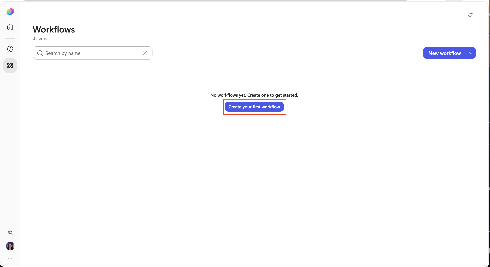

1. Select the **Untitled workflow** text in the upper left hand corner. Replace the name with the following:

    ```text
    Process Supplier Invoice Review Request
    ```

    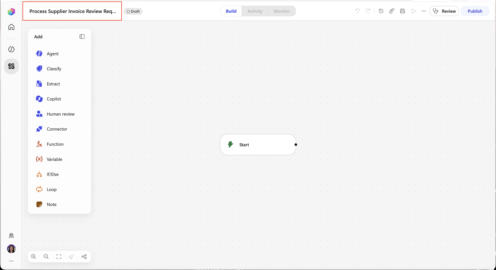

## Add the SharePoint trigger

1. Select the **start node**. Select the **Trigger type** dropdown and select the **Connector** option.

    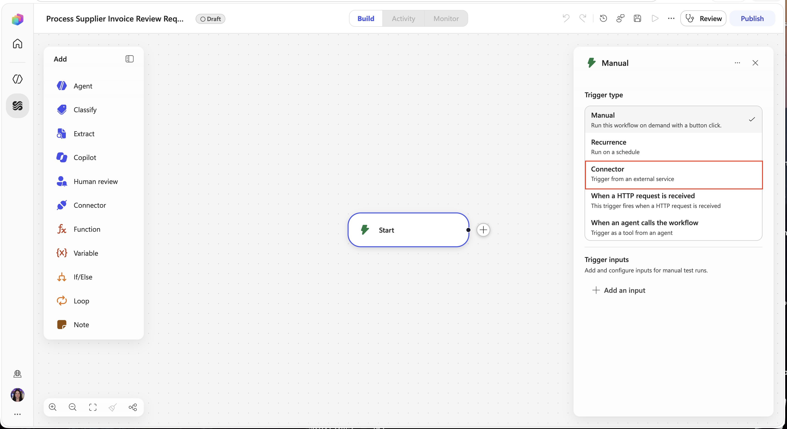

1. In the search box type ``SharePoint When an Item is Created`` and select the **When an item is created** trigger.

    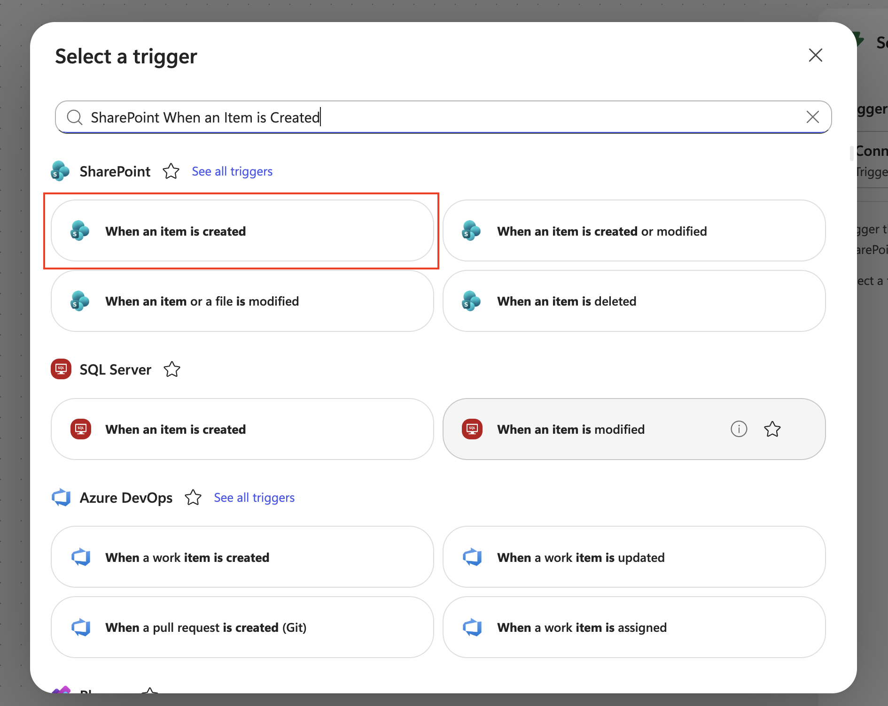

1. In the right hand panel, configure the following:

    | Field | Value |
    | --- | --- |
    | Site Address | +++@lab.CloudCredential(AITour27M365E7).TenantPrefix.sharepoint.com/sites/CaldovaSupplierOps+++ |
    | List Name | `Invoice Review Requests` |

    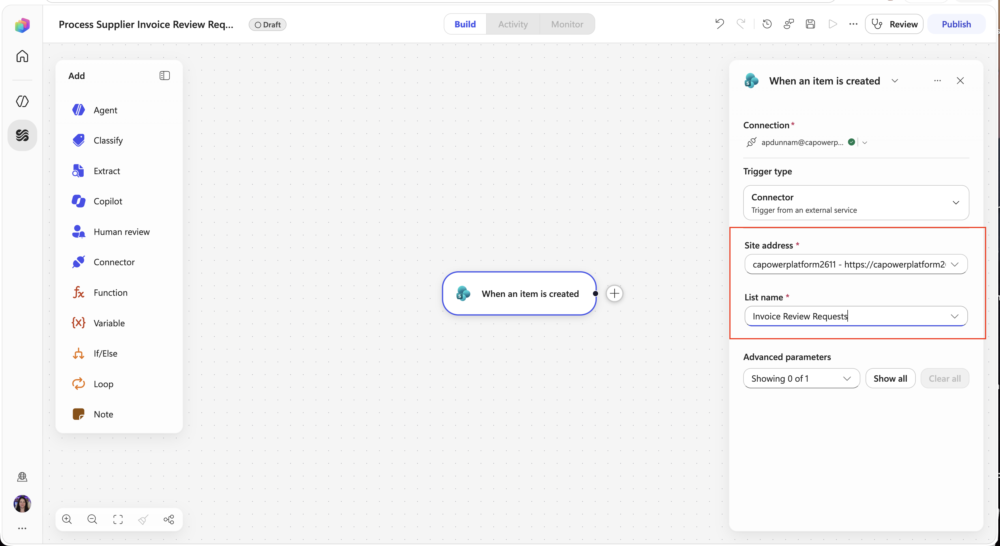

## Add the agent

1. Select the **plug button** next to the **when an item is created** node.

    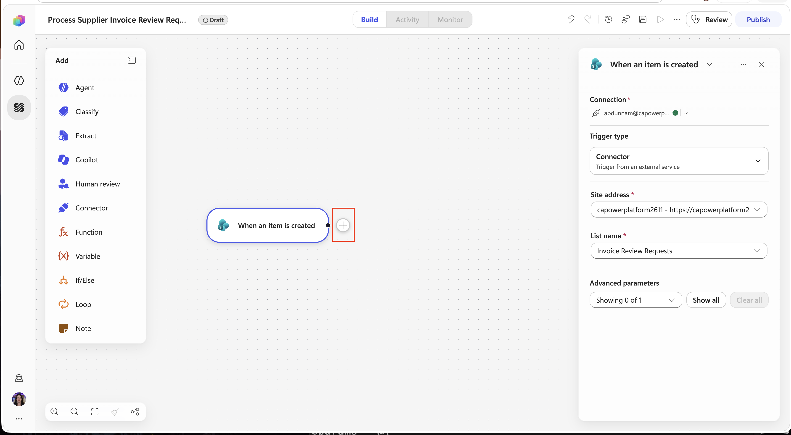

1. Select the **Agent** action from the list of options.

    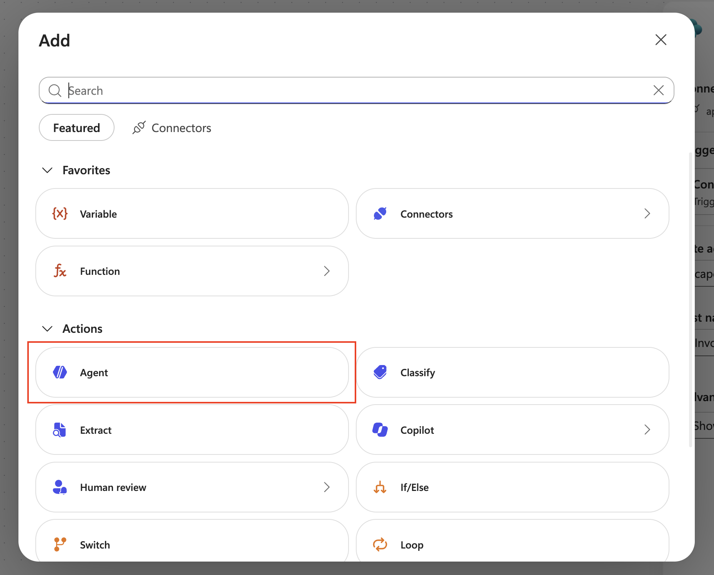

1. Select the **Supplier Assurance Agent** in the **Agent** dropdown on the right hand side.

    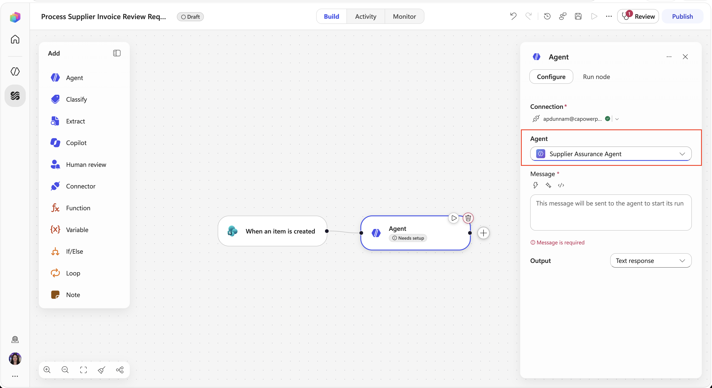

1. Copy and paste the following into the **Message** input.

    ```text
    Review supplier invoice [Invoice ID].

    Request notes: [Request Notes]

    Use the SharePoint MCP for current invoice, line, supplier, and quality records. Use Caldova SharePoint knowledge for the governing contract, approvals, and policy. Run both configured skills.

    Return supported and disputed amounts, reconciliation difference, human-review status and reasons, evidence citations, and a statement that no financial or supplier action was taken.
    ```

    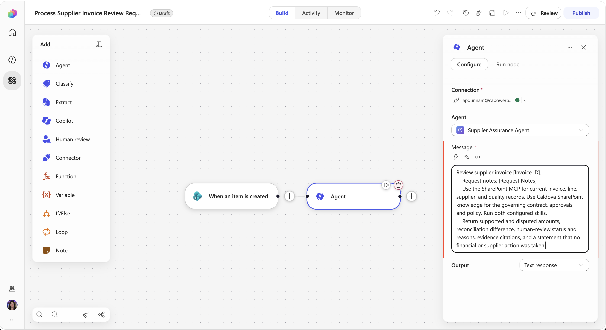

1. Delete the **[Invoice ID]** text in the message. With your cursor where you delete that text, select the **lightning bolt icon**.

    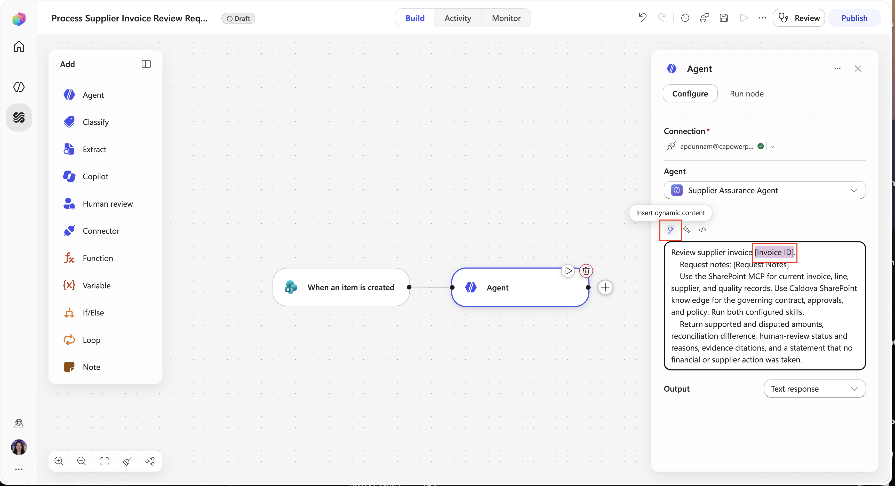

1. Select the **Invoice ID** property from the **When an item is created** trigger.

    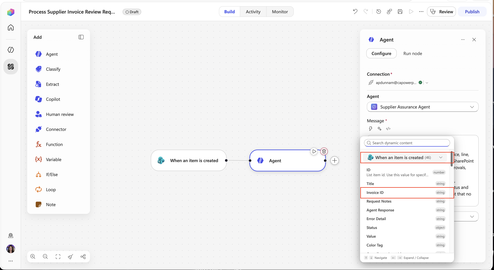

1. Select the **[Request Notes]** text in the message. With your cursor where you delete that text, select the **lightning bolt icon**.

    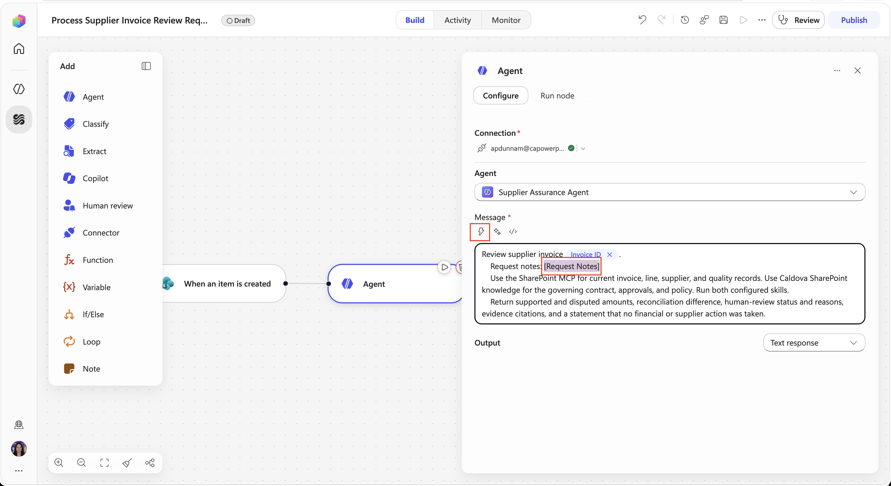

1. Select the **Invoice ID** property from the **When an item is created** trigger.

    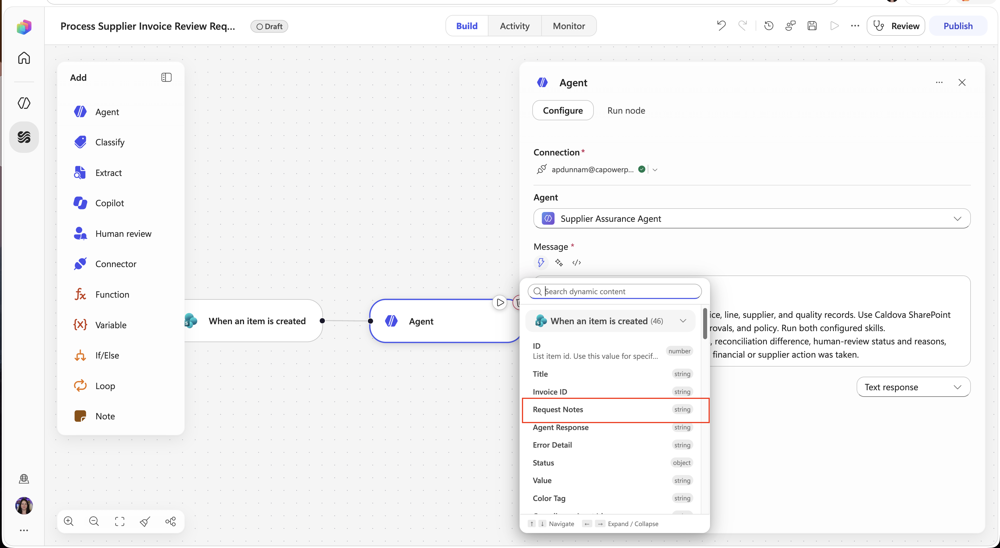

## Update the request

1. Select the **plus button** next to the **Agent** node.

    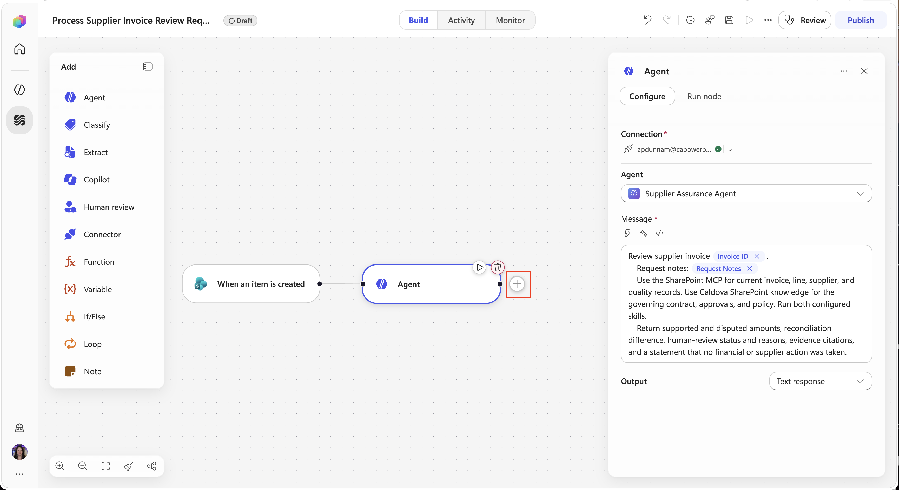

1. In the search box, type ``SharePoint update item`` and select the **Update item** action.

    

1. In the right hand side, configure the properties as follows. Select the **lighting bolt icon** to select the properties:

    | Field | Value |
    | --- | --- |
    | Site Address | The same prepared tenant root SharePoint site |
    | List Name | `Invoice Review Requests` |
    | Id | Trigger `ID` |
    | Title | Trigger `Title` |
    | Invoice ID | Trigger `Invoice ID` |
    | Request Notes | Trigger `Request Notes` |
    | Status | `Complete` |
    | Agent Response | Final response from **Run an agent** |
    | Error Detail | Leave blank |

    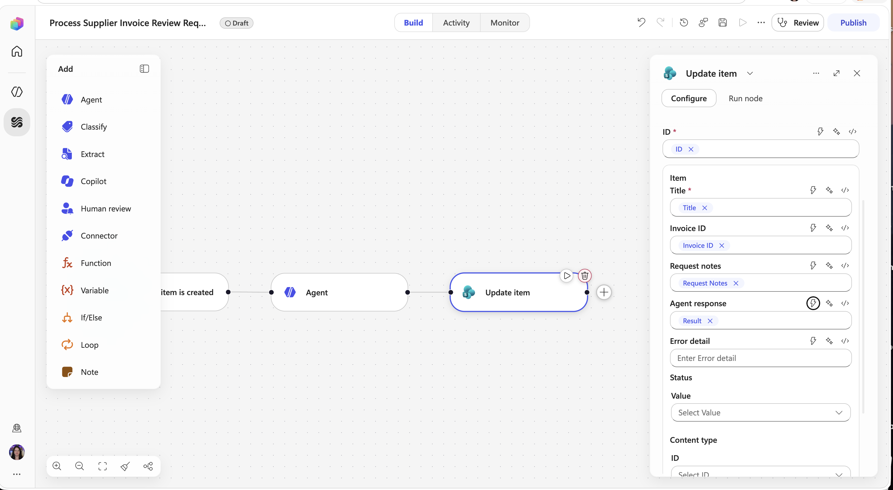

1. Select the **Publish button** to save and publish your changes.

    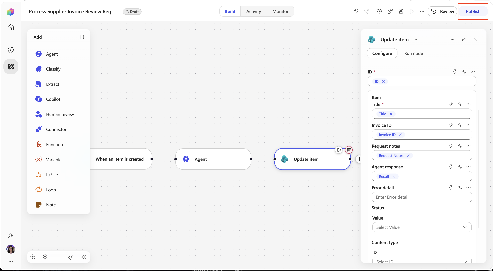

> [!NOTE]
> **Why:** The workflow provides a predictable trigger and stores the result. The agent owns MCP retrieval, knowledge grounding, skill execution, and policy reasoning and the workflow helps to make this process autonomous.

Select **Next** to run the final test.
