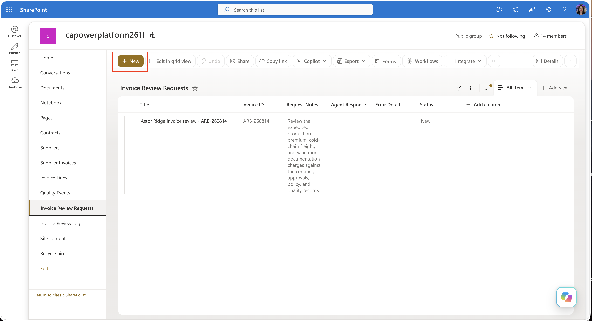
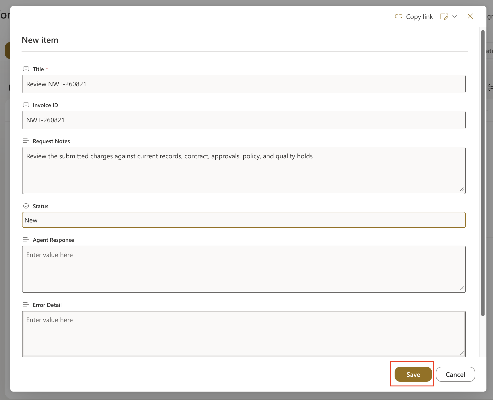
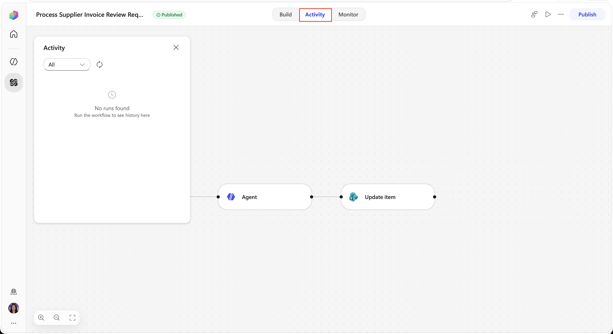
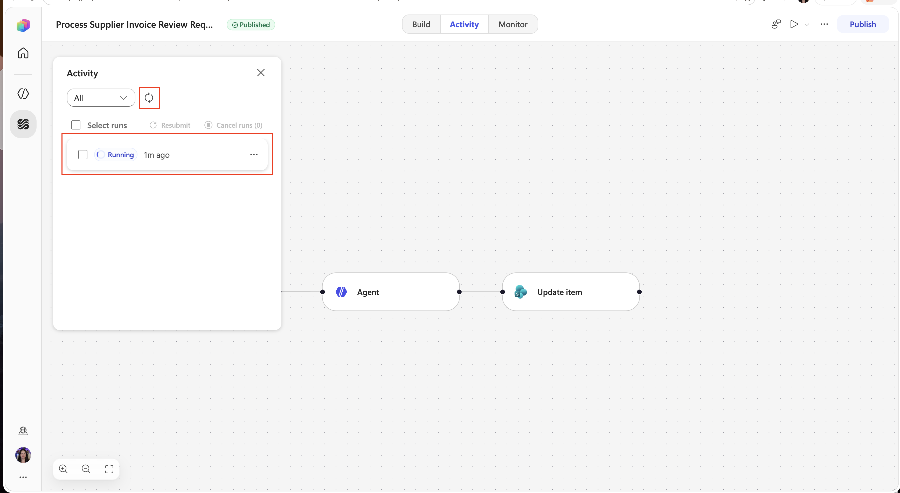
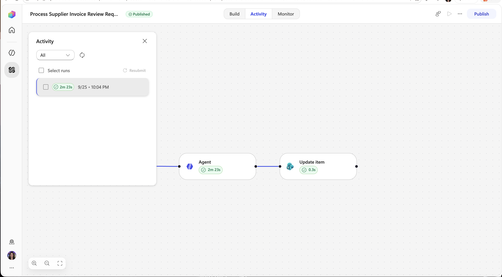
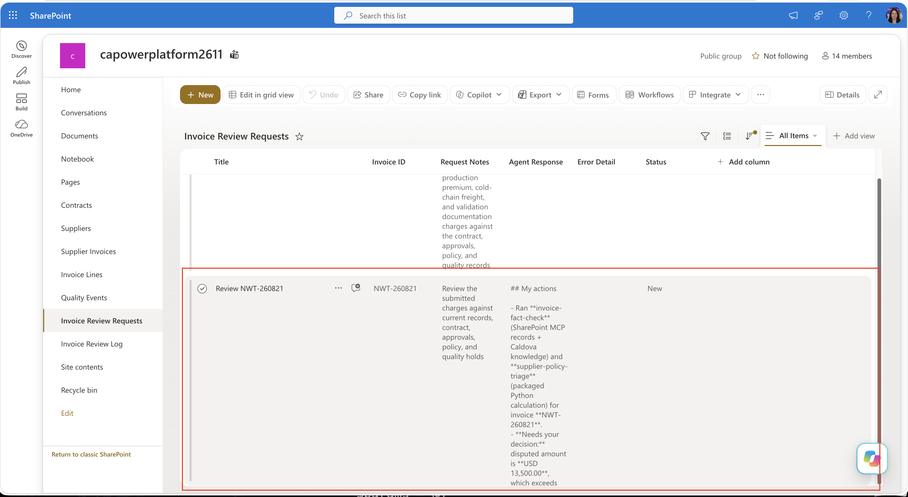
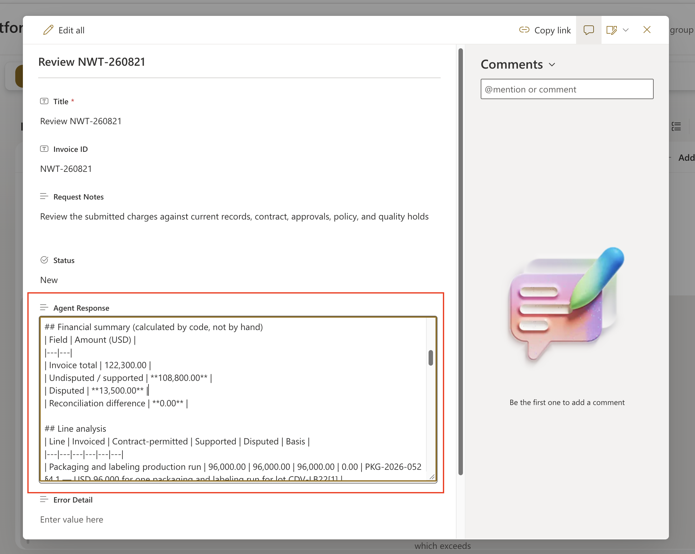

<!-- markdownlint-disable MD034 -->

# 7 - Run the Solution End to End

You have the agent completed and the workflow to allow the end to end process to run autonomously. Now you need to test.

1. Open the invoice review request list:

   +++https://@lab.CloudCredential(AITour27M365E7).TenantPrefix.sharepoint.com/sites/CaldovaSupplierOps/Lists/Invoice%20Review%20Requests/AllItems.aspx+++ 

1. Select the **New** button.

    

1. Enter the following information in the form then select **Save**:

    | Field | Value |
    | --- | --- |
    | Title | `Review NWT-260821` |
    | Invoice ID | `NWT-260821` |
    | Request Notes | `Review the submitted charges against current records, contract, approvals, policy, and quality holds.` |
    | Status | `New` |

    

1. Return to the tab with the Workflow open and select the **Activity** tab.

    

1. Select the **Refresh icon** until you see a running task.

    

1. Confirm the trigger, Run an agent, and Update item nodes complete.

    

1. Go back to the invoice review request SharePoint list and verify that an item appears for **Review NWT-260821**.

    

1. Open the request item and review the Agent Response for the expected result:

- invoice total $122,300
- supported $108,800
- disputed $13,500
- reconciliation difference $0

    

## What happened

| Layer | Responsibility |
| --- | --- |
| Request list and Workflow | Started the review and stored the readable response |
| SharePoint MCP | Retrieved current records and enabled a controlled log write |
| SharePoint knowledge | Supplied contract, approval, policy, and quality-document facts |
| Skills and sandbox | Organized facts, calculated the result, and created the PDF |
| Human reviewer | Owns every financial decision |

No payment, rejection, supplier change, or quality-hold change was made.

Congratulations. Select **Next**, then **Submit** to finish the lab.
